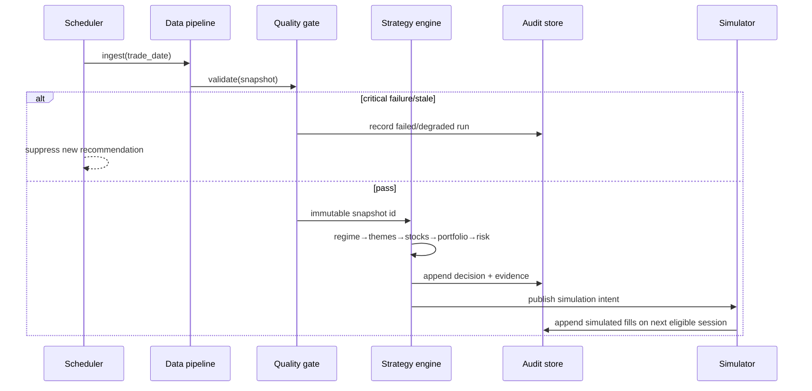

# 系统架构与 API 契约

## 1. 架构原则

采用前后端分离的模块化单体。研究、回测、日终建议和模拟盘共享同一策略内核；通过端口/适配器隔离外部数据。自动交易在架构层不存在：无 broker adapter、无真实订单域、无交易凭据。

```text
Provider adapters -> Raw immutable store -> Point-in-time normalized store
                                             |
                                      Quality gate
                                             |
                    Features -> Regime -> Themes -> Stocks -> Portfolio/Risk
                                             |
                    Backtest <-> Decision snapshots <-> Simulation
                                             |
                                      FastAPI /api/v1
                                             |
                                      React/Next Web
```

## 2. 模块边界

| 模块 | 负责 | 不负责 |
|---|---|---|
| `data` | provider、采集、时点化、交易日历、证券主数据、质量门禁 | 策略判断 |
| `features` | 纯函数特征、特征版本和缺失标识 | 组合选择 |
| `regime` | 市场分项、状态、仓位上限 | 具体股票 |
| `themes` | 历史映射、评分、生命周期、资金代理口径 | 真实账户流向推断 |
| `selection` | 硬过滤、个股评分、候选解释 | 最终仓位 |
| `portfolio` | 3～5 只约束、现金、风险预算、取整、相关性和容量 | 真实下单 |
| `risk` | 初始止损、保护价、退出优先级、组合风控 | 保证损失上限 |
| `backtest` | 时序事件、可成交性、费用、基线、OOS/压力测试 | 使用未来数据 |
| `simulation` | 虚拟委托/成交/现金/净值 | 券商或真实账户 |
| `audit/reporting` | 不可变决策快照、报告和回放 | 修改历史结论 |
| `api` | 读模型、发起受控研究任务、参数校验 | 策略重复实现 |
| `web` | 决策呈现、解释、状态与设置 | 在浏览器计算最终策略 |

模块依赖方向必须从接口层指向应用层，再指向领域层；领域层不得依赖 FastAPI、数据库 ORM 或前端类型。

## 3. 数据分层与主键

1. **Raw**：供应商响应或标准化原始表，仅追加；主键含 `provider + dataset + instrument + observed_at + revision`。
2. **Point-in-time normalized**：以 `effective_at/public_at` 控制可见性；所有历史查询必须带 `as_of`。
3. **Features**：主键含 `trade_date + entity + feature_set_version + data_snapshot_id`。
4. **Decision snapshot**：主键 `decision_id`，唯一 run key 为 `trade_date + account_profile + model_version + data_snapshot_id`。
5. **Simulation ledger**：追加写事件，幂等键为 `simulation_id + decision_id + instrument + event_type`。

核心实体：`Instrument`、`ThemeMembership`、`MarketRegime`、`ThemeScore`、`StockCandidate`、`PortfolioRecommendation`、`PositionRecommendation`、`RiskRule`、`BacktestRun`、`SimulationAccount`、`DecisionSnapshot`、`QualityReport`。

所有金额以人民币元表达，权重 API 统一用 0～1 小数，价格用 decimal，日期为交易所本地日期；事件时间使用带 `Asia/Shanghai` 偏移的 ISO 8601。

## 4. 日终数据流



同一 run key 重跑必须复用或原子替换未发布中间结果，不得重复模拟成交。发布后的决策只能以新版本更正，不能原地覆盖。

## 5. API 契约

统一前缀 `/api/v1`。成功响应返回业务对象；错误结构固定为：

```json
{
  "error": {
    "code": "DATA_STALE",
    "message": "关键行情尚未更新，今日建议已暂停生成",
    "trace_id": "...",
    "details": {"trade_date": "2026-07-06"}
  }
}
```

### 5.1 读取接口

| 方法与路径 | 返回/约束 |
|---|---|
| `GET /health/live` | 进程存活；不得代表依赖健康。 |
| `GET /health/ready` | DB、迁移、provider 状态、数据新鲜度、最近日终 run；降级时非 2xx 或明确 `status=degraded`。 |
| `GET /market/regime?date=` | 状态、仓位区间/建议值、分项、原因、完整性、snapshot/model/time。 |
| `GET /themes?date=&lifecycle=&limit=` | 排名、生命周期及证据；支持分页/限制。 |
| `GET /themes/{theme_id}?date=` | 历史时点题材、成员与分项。 |
| `GET /portfolio/recommendation?date=&profile_id=` | 0～5 只建议、2～3 只备选、现金、风险、原因和数据状态。 |
| `GET /stocks/{code}?date=` | 个股特征/评分、题材、信号、风险、可见数据来源。 |
| `GET /decisions?from=&to=&cursor=` | 审计日志摘要，游标分页。 |
| `GET /decisions/{decision_id}` | 完整只读决策快照及模型/数据 provenance。 |
| `GET /backtests` / `GET /backtests/{id}` | 运行状态、配置、门禁、指标、基线、报告引用。 |
| `GET /simulations/{id}` | 模拟账户、现金、持仓、净值、回撤和数据状态。 |
| `GET /simulations/{id}/ledger` | 追加写事件，分页。 |
| `GET /settings/profile` | 资金、板块、风险限制和通知偏好。 |

`PortfolioRecommendation` 最低字段：

```json
{
  "decision_id": "dec_...",
  "trade_date": "2026-07-06",
  "status": "healthy|partial|risk_off|stale|failed",
  "model_version": "mvp-1.0.0",
  "data_snapshot_id": "snap_...",
  "data_as_of": "2026-07-06T15:30:00+08:00",
  "account_capital_cny": "1000000.00",
  "recommended_exposure": 0.75,
  "cash_weight": 0.25,
  "positions": [{
    "code": "600000.SH",
    "action": "watch|buy|hold|add|reduce|exit",
    "theme_id": "...",
    "target_weight": 0.20,
    "initial_weight": 0.12,
    "entry_range": ["10.20", "10.45"],
    "initial_stop": "9.45",
    "protective_price": null,
    "profit_protection_active": false,
    "thesis": ["..."],
    "invalidation": ["..."],
    "risk_notes": ["..."],
    "expected_holding_days": [40, 80],
    "next_review_date": "2026-07-13"
  }],
  "reserves": [],
  "disclaimer": "研究与决策辅助，不构成收益保证，不会自动执行"
}
```

### 5.2 写接口（仅设置、研究任务、模拟）

| 方法与路径 | 行为 |
|---|---|
| `PUT /settings/profile` | 校验资金 10 万～1000 万、允许板块及风险参数；写审计。 |
| `POST /backtests` | 创建研究任务，返回 `202 + run_id`；参数和数据快照冻结。 |
| `POST /backtests/{id}/cancel` | 取消尚未完成任务，不删除已有日志。 |
| `POST /simulations` | 建立虚拟账户；不得接受券商账户或 API key。 |
| `POST /simulations/{id}/apply-decision` | 幂等应用模型建议为模拟意图；真实成交语义禁止。 |
| `POST /admin/eod-runs` | 受保护的运维入口；接收交易日/idempotency key，不允许任意前端用户调用。 |

契约中永远不提供 `/orders`、`/broker`、`/execute` 等真实交易接口。

## 6. 事件与状态机

- 日终运行：`queued → ingesting → validating → computing → published`，或 `degraded/failed`。
- 回测：`queued → running → completed/failed/cancelled`。
- 建议：`draft → published → superseded`，发布后不可改。
- 模拟意图：`created → eligible → filled/partially_filled/rejected/expired`。
- 数据状态：`fresh/partial/stale/failed/demo`，贯穿 API 与 UI。

## 7. 回测与生产一致性

`StrategyContext` 是唯一策略入口，至少包含 `as_of`、`data_snapshot_id`、`feature_set_version`、`model_version`、`account_profile`、`cost_model`。回测通过历史时钟逐日调用该入口；生产日终通过当前交易日调用。成交模拟在策略引擎外处理，确保策略不能看到未来成交。

随机过程必须固定 seed 并记录。参数搜索输出全部实验，不只保存最佳结果；最终样本外区间在冻结参数后才运行。

## 8. 安全、审计与可观测性

- 环境变量/密钥管理加载 provider 凭据；前端只获得必要的只读数据。
- API 按角色划分只读用户、研究者、运维；管理日终和回测启动需鉴权。
- 结构化日志包含 `trace_id/run_id/decision_id/data_snapshot_id/model_version`，不包含 token。
- 指标：采集延迟、质量失败数、数据最新交易日、日终耗时、建议数量、模拟拒绝、回测队列、API 延迟/错误率。
- 告警：交易日收盘后数据超时、质量门禁失败、日终失败、建议违反 3～5/权重约束、模拟账不平、备份失败。
- 决策与模拟台账追加写；普通 API 无删除能力。数据库备份与原始快照分开保留。

## 9. 部署拓扑

开发/单机 MVP：`web + api/worker + postgres + object/parquet storage`，可用 Docker Compose；Demo 数据可完全离线。生产化时调度器只触发幂等任务，API 与 worker 可分进程，但仍共享同一领域包和迁移。任何环境都不部署 broker 组件。
